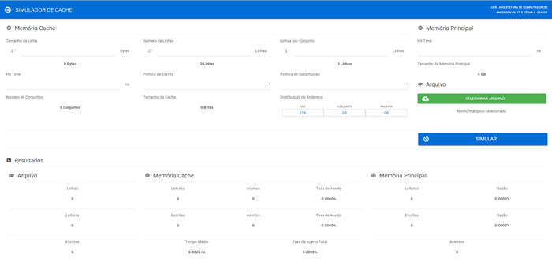

# Simulador de Memórias Cache

**Resumo.** Este trabalho tem por objetivo analisar o desempenho de memórias
cache desenvolvendo um software para a simulação utilizando mapeamento
associativo por conjunto. Os dados para a simulação são obtidos a partir da
leitura de um arquivo texto que é interpretado de acordo com os parâmetros
fornecidos pelo usuário.

**Abstract.** This task has as main goal analyze the performance of a CPU Cache
creating a simulation software using a set associative cache. Datas are
obtained from a text file that will be interpreted according to the parameters
provided by the user.

A descrição detalhada do projeto assim como os testes realizados podem ser encontrados no arquivo [relatorio.pdf](relatorio.pdf) que acompanha o código fonte.

**DEMO:** [http://cache.megadatasistemas.com.br/](http://cache.megadatasistemas.com.br/)
